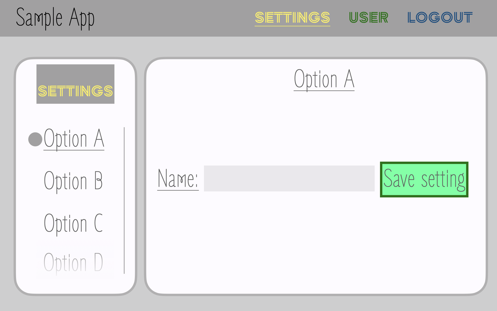
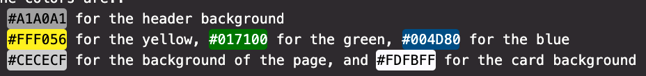

# Welcome

### And good luck

Welcome to Sample App!  Here you will see a rough wireframe for a sample app

For Reference:

The fonts used are:

- Zen Loop
- Zen Tokyo Zoo

The colors are::
- #A1A0A1 for the header background
- #FFF056 for the yellow, #017100 for the green, #004D80 for the blue
- #CECECF for the background of the page, and #FDFBFF for the card background

The mocks are left intentionally vague so please ask as many questions as needed

Google is encouraged of course, so please reference CSS docs, Stackoverflow, and feel free to iterate and using any browser dev tools to move forward
